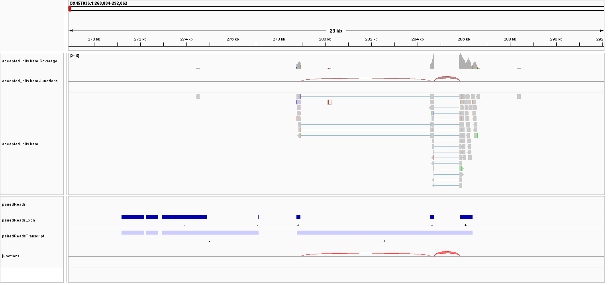

--- 
title: "Portfolio"
author: "alena savachenko"
date: "`r Sys.Date()`"
site: bookdown::bookdown_site
bibliography: [bib/min_seq.bib, bib/genvisr.bib, bib/celegance.bib] 
csl: assets/apa.csl


output: 
  bookdown::gitbook:
    css: style.css
    includes:
      after_body: assets/html/after.html 
    config:
      toc:
        before: |
          <li class="toc-logo"><a href="./"></a></li>
          <li><a href="./">Data science for biology </a></li>

    
---

# Introduction. CV

<div class= "pd22">

This is a Markdown document created as an introduction to a  data science portfolio.

</div>


<h3>  CV </h3>

````{=html}
```{r, echo=FALSE, results='asis'}
xfun::file_string('assets/html/cv_index.html')
```
````


<!--chapter:end:index.Rmd-->

# Genome annotatie ab de novo.Inleiding


```{r, warning=FALSE, error=FALSE, echo=FALSE, message=FALSE}
library(tidyverse)
library(ggplot2)
library(dplyr)
library(knitr)
library(kableExtra)
```


Dit onderwerp van onderzoek is heel belangrijk, omdat er in de experimentele wetenschap momenteel gezocht wordt naar alternatieven voor het gebruik van dieren in verschillende laboratoriumexperimenten. Aangezien verschillende wormsoorten een belangrijke rol spelen als modellen in medisch en biologisch onderzoek, is het cruciaal om hun genetisch materiaal te onderzoeken. Dit project richt zich specifiek op de analyse van het genoom van de soort Lumbricida.De soort Lumbricus Terresteris hoort tot de fylogenetische  familie Annelida,  Clitellata, Oligochaeta, Crassiclitellata,  Lumbricina,  Lumbricidae [@erxlebenGenomeAnnotation0000]. De soort ringwormen (Annelida) zijn de oudste evolutionaire groep. De musculatuur lijkt hier sterk op de dwarsgestreptte musculatuur van dieren.[@giovannipilatoSignificanceMusculatureOrigin]. Daarom is deze soort een van de mensrelevante modellen voor laboratoriumonderzoek.

Genoomannotatie is het proces dat gericht is op het identificeren van functionele componenten binnen een DNA-sequentie. Dit proces van annotatie biedt inzicht in het genoom door de plaats en functie van genen te specificeren, waaronder genen die eiwitten coderen of andere functies vervullen, evenals de bijbehorende regulerende elementen. De assemblage is altijd gebaseerd op de reads die zijn gegenereerd tijdens het sequentieproces. Het proces van genoomassemblage houdt in dat het originele genoom wordt gereconstrueerd uit kleine stukjes DNA, verkregen door middel van sequenting[@NovoAssemblyTutorial]. Deze reads zorgen ervoor dat het oorspronkelijke genoom meestal meerdere keren wordt gedekt. Bij het analyseren van genomische en metagenomische gegevens, is de gebruikelijke oplossing een verzameling contigs. Een contig is een aaneengeschakelde nucleotidesequentie. Deze contigs kunnen worden samengevoegd tot scaffolds, waarbij scaffolds bestaan uit een reeks contigs met een schatting van de afstanden tussen deze sequenties[@NCBIEukaryoticGenome]  processen van genomassemblage en annotatie  zijn geïntegreerd in een groter geheel dat zich richt op de identificatie van het genoom.
Het annoteren van genoom is nog steeds een proces dat veel tijd kost en verschillende soorten sequentieanalyses samenbrengt. Gezien de grootte en complexiteit van genomen,  is de eerste stap naar volledige genoomassemblage meestal het verkrijgen van sequencinggegevens  om ruwe assemblage en voorspelling  van genmodellen  te verkrijgen.


Het hele annotatieproces bestaat over het algemeen uit de volgende stappen   :
1) Het maskeren van sterk repetitieve elementen in de genoomsequentie 
2) het gebruik van transcripten en eiwitten van dezelfde of verwante soorten om ab initio te voorspellen . De bekende transcripten en eiwitten zijn opgeslagen in genetische databases zoals NCBI en BLAST. 
3) gebruik van  genzoekalgoritmen om mogelijke genstructuren te identificeren;
4) het combineren van deze gegevens om een eerste reeks genmodellen te creëren;
5) filteren van de resultaten op kwaliteit  om de meest waarschijnlijke genmodellen te identificeren die volledige eiwitcoderende regio's.[@ncbi.nlm.nih.govNCBIEukaryoticGenome] . In eerste instantie wordt de kwaliteitsselectie uitgevoerd met behulp van een set positieve controles voor het programma. Na het voltooien van deze controles wordt het  percentage  fout-positieven resuultaten duidelijk zichtbaar.

Een overzicht van publiek beschikbare genomen en annotaties in de  soort Lumbricus terrestris.

Hoewel er in de bestaande literatuur slechts een beperkt aantal studies is dat de assemblage en annotatie van het genoom van Lumbricus terrestris behandelt, zijn er wel talrijke beschrijvingen van de genoomannotatie van andere organismen. Voor de soorten C.Elegans en Lubricus Rubellis  is er bijvoorbeeld een volledige annotatie. Voor het eerst wordt een gedetailleerde genoomassemblage van de genen van een soort  Lumbricus terrestris gepubliceerd op 30 oktober [@blaxterGenomeSequenceCommon2023]. Door de innovatieve long-read sequencing methoden van Pacific Biosciences hebben de wetenschappers het genoom  gesequenced en gepubliceerd. Hoewel het gepubliceerde genoom compleet is op sequentieniveau, is de analyse van de annotaties erg fragmentarisch. Deze genoomassemblage is de eerste die voor het publiek beschikbaar is. Het project legt de focus op het verder onderzoeken van de metadata van genoomassemblages. Tot nu toe zijn er in de literatuur geen uitgebreide en systematische studies gedaan over de annotatie van het Lumbricus terrestris genoom.

#   Samenvatting  
## 1.Training van het AUGUSTUS-programma voor het ontdekken van nieuwe genmodellen en hun patronen.

 De training van AUGUSTUS vond plaats in verschillende stappen. In het begin werd de predictor uitgevoerd met de standaardinstellingen voor caenorhabditis, wat leidde tot 11.000 voorlopige genmodellen voor één chromosoom, maar met een vrij lage nauwkeurigheid in de voorspellingen. Voor het opstellen van een eerste trainingsset van genen werden RNA-sequencingdata gebruikt. De transcriptomereads werden met TopHat op het genoom gemapt (zie documentatie protocol1, data_processing). Dit resulteerde in 9.953 voorspelde genmodellen per chromosoom op basis van het transcriptoom. Gemiddeld waren de genen ongeveer 5.146 baseparen lang, en elk gen had meestal rond de 3,2 exons (zie protocol1, data_processing, genemarkES, genemark.average_gene_length.out). De exons waren gemiddeld 1.719 baseparen, terwijl de introns gemiddeld 4.760 baseparen lang waren. 
 
 Daarna werden de genensets gefilterd met het Augustus-programma filterGenemark.pl. Na de filtratie bleven er 1.975 genen over op één chromosoom. Etrain werd uitgevoerd met genen die uit het transcriptoom kwamen. De uiteindelijke parameters werden gebruikt om de gff-annotatie te genereren. Een de novo-model met hoge specificiteit en sensitiviteitsscores van 8-9 voor de Lumbricus Terresstris werd verkregen via de mRna-pijplijn.
 

## 2.. De training van het AUGUSTUS-programma met proteïne  van langere evolutionaire afstand 

Het AUGUSTUS-programma is getraind met proteïne  die een langere evolutionaire afstand hebben. Hiervoor is een database uit Ortho DB, Arthropoda [@BioinformaticsWebServer] gebruikt. Deze database is voorbereid met "ProtHints", wat een onderdeel is van de Braker-pipline[@GaiusAugustusBRAKER2024a]. Voor de BLAST-analyse werd de versie ncbi-blast-2.16.0+ toegepast (zie protocol 2 documentatie). De OrthoDB-database diende als referentie. Om redundantie te verminderen, zijn alle trainingsgen aminozuursequenties met elkaar vergeleken en zijn alleen die eiwitsequenties behouden die minder dan 80% redundant zijn met andere sequenties in de set (zie protocol 2, scripts en documenten). Hieruit is een model (species) afgeleid dat de annotatie heeft opgeleverd.

Na het verwijderen van redundante genstructuren in de proteïne-pijplijn, zijn de specificiteit en gevoeligheid gestegen van 0,01 naar 0,4-0,5 punten voor het de novo-model van de eiwitpijplijn.

#    Alignment. Ruwe gegevens inspecteren

Voor de Alignment  zijn Bowtie en Tophat gebruikt. Het transcriptome ID49 is afkomstig van Project: PRJEB59399[@ENABrowser], dat een verzameling genomische en transcriptomische data bevat voor Lumbricus terrestris, ook wel de gewone regenworm genoemd. Dit project is opgezet om de assemblage en annotatie van het genoom te ondersteunen. Je kunt de ruwe gegevens hier bekijken: https://www.ebi.ac.uk/ena/browser/view/PRJEB59399.
Reference genoom: https://ftp.ensembl.org/pub/rapid-release/species/Lumbricus_terrestris/GCA_949752735.1/ensembl/genome/


Eerst wordt de index opgebouwd met bowtie2. Daarna vindt de Alignmenet  plaats met Tophat. Cufflinks voegt alle reads samen tot transcripties met: cufflinks accepted_hits.bam.


```{bash, eval=FALSE}
bowtie2-build -f  Lumbricus_terrestris-GCA_949752735.1-softmasked.fa  lumter  --large-index 
```


```{bash, eval=FALSE}
tophat lumter     sample_1.fastq  sample_2.fastq \                           
 --output-dir TopHAT \ 
 
```


```{bash, eval=FALSE}

 cufflinks  accepted_hits.bam
 
```


Cufflink zal transcripts.gtf genereren, terwijl TopHat accepted_hits.bam aanmaakt met de resultaten van de uitlijning en een lijst van uitlijningen in jucntions.bed. Elke junction bestaat uit twee verbonden BED-blokken, waarbij elk blok zo lang is als de maximale overhang van een lees die de junction overspant. De score is het aantal uitlijningen dat de junction overspant. 
Het uitvoerbestand introns.gff bevat informatie over de strengen die gebruikt kan worden voor ET-training.
<p> OX457036.1	TopHat2	intron	253060	254504	12	+	.	. </p>

 Ten eerste moeten we de ruwe gegevens bekijken die we hebben van de genoom-Alignment . Elke junction bestaat uit twee verbonden BED-blokken, waarbij elk blok zo lang is als de maximale overhang van een lees die de junction overspant. De score is het aantal uitlijningen dat de junction overspant. Junctions.bed (TopHat, protocol1, script2):

```{r, echo=FALSE}

  junctions<- read.table("lumbricus/protocol1/data_processing/TOPHAT/junctions.bed", sep="\t", skip=1)        

```

```{r}
head(junctions)
```


Cufflink verwerkt de uitgelijnde RNA-Seq-reads die van Tophat komen en bouwt ze op in de transcripten en exonen.

```{r}


transcripts <- read.table("lumbricus/protocol1/data_processing/TOPHAT/transcripts.gtf", sep="\t") 

colnames(transcripts) <-  c("chr", "versie", "feature", "start", "end", "score", "strain", "v8")

transcripts  %>%  select(1:5)  %>% head()


```

1. We gaan de outputbestanden van Tophat+Cufflink, namelijk accepted_hits.bam en junctions.bed, in IGV zetten, samen met het transcriptbestand van Cufflinks. Eerst hebben we een bed-bestand nodig.


```{bash, engine.opts='-i',, eval=FALSE}

awk '{if($3=="exon" ) {print $1,$4,$5, $7, $3 }}'  transcripts.gtf  > exon_ids.bed

awk '{if($3=="transcript" ) {print $1,$4,$5, $7, $3 }}'  transcripts.gtf  > tranasctips_ids.b
```
1. Bekijk de bed-bestanden voor de genoombrowser:

```{r}
exons_ids <- read.table("lumbricus/protocol1/data_processing/TOPHAT/igv/exon_ids.bed", sep="\t") 

transcript_ids <- read.table("lumbricus/protocol1/data_processing/TOPHAT/igv/transctipts_ids.bed", sep="\t") 

head(exons_ids)
head(transcript_ids)
```

Bekijk de exonen (diepblauw) en transcripties (lichtblauw) in IGV:


```{r junctions1, echo=FALSE, fig.cap="exon-transcripts structure chr1:23kb", out.width = '100%'}
knitr::include_graphics("lumbricus/protocol1/data_processing/TOPHAT/igv/exontranscripts.png")
```

 Vervolgens plaatsen we junctions.bed (rood) en geaccepteerde hits of reads (grijs) op dezelfde track om de exon-intronstructuur te visualiseren.


```{r junctions2, echo=FALSE, fig.cap="exon-intron structure chr1:23kb, reads in grey", out.width = '100%'}

```


Voordat we GeneMarkET uitvoeren, verzamelen we enkele statistieken uit de primaire analyse. 
Eerst bekijken we de gemiddelde introns, exonen en lengtes.


```{r, warning=FALSE, error=FALSE}

introns  <- read.table("lumbricus/protocol1/data_processing/TOPHAT/introns.gff", sep="\t")

colnames(introns) <- c("chr","aligner","structure", "start", "end", "score", "strand", "v8", "v9")

head(introns)

introns_length <- introns %>%   mutate(ilength=end-start)

max_intron <-  max(introns_length$ilength)  %>%  round(digits = 1)

 avr_intron <-  mean(introns_length$ilength)  %>%  round(digits = 1)

```


```{r}
exons  <- read.table("lumbricus/protocol1/data_processing/TOPHAT/transcripts.gtf", sep="\t")

exons  <- exons %>%  select(1:5)
colnames(exons) <- c("chr","aligner","structure", "start", "end")
exons_length <- exons %>%   mutate(elength=end-start)

max_exon <-  max(exons_length$elength)  %>%  round(digits = 1)
max_exon
avr_exon <-  mean(exons_length$elength) %>%  round(digits = 1)
```

<p> maximale lengte van intron : `r max_intron` </p>
<p> gemiddelde intronlengte `r avr_intron` </p>

<p> maximale lengte van exon : `r max_exon` </p>
<p> gemiddelde lengte exon `r avr_exon` </p>


```{r, warning=FALSE,message=FALSE, echo=F}
data <- data.frame(
  name=c("exon","intron") ,  
  value=c(avr_exon, avr_intron)
)
plot <-  ggplot(data, aes(x=name, y=value)) + 
  geom_bar(stat = "identity") +
  geom_text(aes(label = round(value,1), vjust = -0.2)) +
  ggtitle ("average length introns/exons, bp")+
  labs(y="length, bp")+
  labs(x="average length bp")
```


```{r, figures-side, fig.show="hold", out.width="50%"}
plot
```


## GenemarkET. Model opbouwen (protocol 1). mRna pijplijnne 
## Deel 1. Model opbouwen

Het script bed_to_gff.pl van GeneMarkES maakt introns.gff aan vanuit de TopHat junctions.bed. Dit bestand bevat informatie over de strengen en kan direct gebruikt worden met GeneMarkET (protocol 1, script 2).


```{r}

introns  <- read.table("lumbricus/protocol1/data_processing/TOPHAT/introns.gff", sep="\t")

colnames(introns) <- c("chr","aligner","structure", "start", "end", "score", "strand", "v8", "v9")

head(introns)
```

Om genemark met introns.gff uit te voeren:


```{bash, eval=FALSE}
 
 ../../gmes_petap.pl     --verbose --sequence   genome.fa   --ET  introns.gff
```


2. GeneMarkET gaat een ghmm-model en genemark.gtf produceren.  Dit bestand(gtf)  bevat informatie over de start- en eindcoördinaten van genen, die in de daaropvolgende stap gebruikt zal worden.

```{bash, engine.opts='-i', echo=TRUE, eval=TRUE}
 cut -f 2,3,4,5  lumbricus/protocol1\
 /data_processing/GeneMarkES/genemark.gtf  | head
```

1. Genemark maakt gebruik van filterGenemark.pl voor kwaliteitscontrole. Dit zorgt ervoor dat alleen de genmodellen die geregistreerd zijn in de exon-intronstructuur behouden blijven. (protocol1, script3) Na het filteren van de primaire resultaten wordt er een set van 1.975 genmodellen voor één chromosoom opgeslagen in genemark.f.good.gtf.


```{bash, engine.opts='-i', echo=TRUE, eval=TRUE}
 cut -f 2,3,4,5  lumbricus/protocol1/data_processing/GeneMarkES/genemark.f.good.gtf   | head
```

1. Genemark.f.good.gtf is nu klaar om een trainingsset te maken van (protocol1, stap 4 en 5). Eerst wordt gtf omgezet naar gb. Zie protocol1, data_processing, Bonafide.


```{bash, eval=F}

gff2gbSmallDNA.pl bonafide.gtf genome.fa 450 tmp.gb
filterGenesIn_mRNAname.pl bonafide.gtf tmp.gb > bonafide.gb

```

```{bash,  engine.opts='-i', echo=TRUE, eval=TRUE}

cat lumbricus/protocol1/data_processing/bonafide/bonafide.gb | head 

```


## Etrain (protocol7)

Op basis van de genen die we hebben verkregen via mRNA-alignment, gaan we een trainingsset opstellen om een nieuw model te trainen. In de vorige sectie hebben we bonafide.gb aangemaakt, waarin 1.975 geverifieerde genen voor een specifiek chromosoom zijn opgenomen. We zijn nu klaar om de ontwikkeling van een nieuwe species  te starten.

 
```{bash,  engine.opts='-i', echo=TRUE, eval=FALSE}

conda activate c 
new_species.pl --species=lumter
```
 

```{bash,  engine.opts='-i', echo=TRUE, eval=FALSE}

etraining --species=lumter bonafide.gb &> bonafide.out

```

Check for Stop Codonds:


```{bash,  engine.opts='-i', echo=TRUE, eval=FALSE}

grep -c "Variable stopCodonExcludedFromCDS set right" bonafide.out

```
0

We hoeven geen bad  lijst op te stellen, omdat er geen stopcodons in de CDS aanwezig zijn.


```{bash,  engine.opts='-i', echo=TRUE, eval=FALSE}

grep -c LOCUS bonafide.gb

```

1975

Het randomSplit.pl-script splitst de data op in twee segmenten: een kleinere sectie genaamd test.gb voor trainingsdoeleinden, en een grotere sectie die train.gb wordt genoemd voor de evaluatie van het trainingsproces.


```{bash,  engine.opts='-i', echo=TRUE, eval=FALSE}


randomSplit.pl bonafide.gb 200
mv bonafide.gb.test test.gb
mv bonafide.gb.train train.gb


```


```{bash,  engine.opts='-i', echo=TRUE, eval=FALSE}

etraining --species=lumter train.gb &> etrain.out
```

Deze configuratie kan worden aangepast in het configuratiebestand (map config, species, lumter_parameters.cfg).

tag: 511 (0.259)
taa: 700 (0.354)
tga: 764 (0.387)


Evaluatie van de voorspelling:

```{bash, eval=FALSE}
augustus --species=lumter test.gb > test.out
```

*******      Evaluation of gene prediction     *******

```{bash, eval=FALSE}
---------------------------------------------\
                 | sensitivity | specificity |
---------------------------------------------|
nucleotide level |       0.963 |       0.972 |
---------------------------------------------/

----------------------------------------------------------------------------------------------------------\
           |  #pred |  #anno |      |    FP = false pos. |    FN = false neg. |             |             |
           | total/ | total/ |   TP |--------------------|--------------------| sensitivity | specificity |
           | unique | unique |      | part | ovlp | wrng | part | ovlp | wrng |             |             |
----------------------------------------------------------------------------------------------------------|
           |        |        |      |                 78 |                 87 |             |             |
exon level |    389 |    398 |  311 | ------------------ | ------------------ |       0.781 |       0.799 |
           |    389 |    398 |      |   56 |    6 |   16 |   56 |    6 |   25 |             |             |
----------------------------------------------------------------------------------------------------------/

----------------------------------------------------------------------------\
transcript | #pred | #anno |   TP |   FP |   FN | sensitivity | specificity |
----------------------------------------------------------------------------|
gene level |   389 |   398 |  311 |   78 |   87 |       0.781 |       0.799 |
----------------------------------------------------------------------------/
# total time: 31.2
# command line:
# augustus --species=wormET0 test.gb

```

See also: lumbricus/protocol1/test/test.out

Hier eindigt onze mRNA-pijplijn, waarbij we een hoge specificiteitsscore hebben bereikt voor het model dat we hebben gemaakt voor Lumbricus Terrestris. Dit model zal dienen voor visualisatie.
 
## ProtHints en de eiwitpijplijn  
## ProtHints  

Er zijn veel genen in verschillende genoom die door hun evolutionaire oorsprong met elkaar verbonden zijn. De gelijkenis tussen eiwitsequenties is goed zichtbaar. OrthoDB is een belangrijke bron voor eiwitten en dient als een database die eiwitten met een uitgebreider evolutionair verleden omvat. Zie protocol 2.

```{bash, eval=F}
../bin/prothint.py  ../OX457036.1.fasta  ../Arthropoda.fa
```

```{bash, eval=F}
grep ">" seed_proteins.faa  | wc -l
```

14733

Prothint heeft een database met eiwitten voorbereid voor startAlign.pl. Het resultaat was 14.733 eiwitten in het bestand seed_proteins.faa. Dit seed-bestand kan worden gebruikt met startAlign.pl om een gth.concat.alg-object te verkrijgen, dat vervolgens wordt gebruikt om bonafide.gb te genereren.


```{bash,  engine.opts='-i', echo=TRUE, eval=TRUE}
head lumbricus/protocol2/data_processing/ProtHints/seed_proteins.faa
```


Naast het seed_proteins.faa  genereert protHints een prothint_augustus.gff hintsbestand dat je direct kunt gebruiken met augustus.

```{bash,  engine.opts='-i', echo=TRUE, eval=TRUE}
head lumbricus/protocol2/data_processing/\
ProtHints/prothint_augustus.gff
```


2. We kunnen augustus meteen draaien met de  prothint_augustus.gff   die door de eiwitten zijn gemaakt, voordat we de trainingsset aanpakken.


```{bash,  engine.opts='-i', echo=TRUE, eval=FALSE}

 augustus --species=lumter\
 --predictionStart=2000000 --predictionEnd=3000000\
 OX457036.1.fasta\
 --extrinsicCfgFile=extrinsic.cfg\
 --hintsfile=prothint_augustus.gff \
 > augustus.hints.prots.orthodb.arthropoda.2-3mb.gff
```

 Hierdoor ontstaat een annotatie voor 2mb-3mb van het chromosoom, gebaseerd op de eiwitindicaties van eiwitten die een lange evolutionaire afstand hebben.

```{bash,  engine.opts='-i', echo=TRUE, eval=TRUE, out.width = '100%'}
cat   lumbricus/protocol2/data_processing\
/ProtHints/augustus.hints.prots.orthodb.arthropoda.2-3mb.gff | \
tail -n 50
```

##  Protocol 2. Het creëren van genstructuren voor training op basis van eiwitten.
## GenomeThreader

We hebben 14.733 eiwitten verzameld uit de eerdere secties. Nu gaan we een trainingsset opzetten met deze eiwitten. Uit de oorspronkelijke 14.733 eiwitten hebben we een klein deel gekozen om de trainingsset te vormen.
 
```{bash, eval=FALSE}

startAlign.pl  --genome OX457036.1.fasta  \
--prot seed_proteins.faa  \
--pos OX457036.1:1-10000000 \
--prg gth

```

2. Hierdoor ontstaat het object gth.concat.aln, dat vervolgens kan worden geconverteerd naar het gtf-formaat (protocol2 ,data_processing, protHints).

```{bash, eval=F}
 gth.concat.aln bonafide.gtf
```


Controleer het gtf-bestand :

```{bash,  engine.opts='-i', echo=TRUE, eval=TRUE, out.width = '100%'}
head lumbricus/protocol2/data_processing/Bonafid/bonafide.gtf 

```


```{bash, eval=F}
computeFlankingRegion.pl bonafide.gtf
```

Output van  computeFlankingRegion.pl:

Total length gene length (including introns): 5412279. Number of genes: 1090. Average Length: 4965.39357798165
The flanking_DNA value is: 2482 (the Minimum of 10 000 and 2482)


```{bash, eval=F}
gff2gbSmallDNA.pl bonafide.gtf genome.fa 2482 bonafide.gb
```

 Bonafide.gb wordt in de volgende pipeline gebruikt om redundantie te verwijderen.

## Protocol 6.Verwijderen van Redundant Genstructuren (protocol 6)

Voor NCBI Blast, controleer de link en stel het Path  in naar de Blast uitvoerbare bestanden.

```{bash, eval=F}
wget ftp://ftp.ncbi.nlm.nih.gov/blast/executables/blast+/LATEST/
```

export PATH=$PATH:$HOME/ncbi-blast-2.16.0+

Maak gebruik van de opgegeven commandoregel om het GTF-bestand van de trainingsgenstructuur te transformeren naar een FASTA-bestand dat de eiwitsequentie omvat.

```{bash, eval=F}
gtf2aa.pl genome.fa bonafide.f.gtf prot.aa
```


Inspecteer  prot.aa :

```{bash,  engine.opts='-i', echo=TRUE, eval=TRUE, out.width = '100%'}
head lumbricus/protocol2/data_processing/Redundancy/prot.aa
```

Voer een Blast  uit van alle eiwitsequenties uit de vorige stap met elkaar en toon alleen de eiwitsequenties die minder dan 80% identiek zijn aan een andere sequentie in de groep.

```{bash, eval=F}

aa2nonred.pl prot.aa prot.nr.aa


```


```{bash,  engine.opts='-i', echo=TRUE, eval=TRUE, out.width = '100%'}
head lumbricus/protocol2/data_processing/Redundancy/prot.nr.aa

grep ">"  lumbricus/protocol2/data_processing/Redundancy/prot.nr.aa | wc -l
```

Daarna hebben we 602 niet-redudante eiwitten om mee verder te gaan:


```{bash,  engine.opts='-i', echo=TRUE, eval=TRUE, out.width = '100%'}

grep ">"  lumbricus/protocol2/data_processing/Redundancy/prot.nr.aa | wc -l
```


```{bash, eval=FALSE}
cat bonafide.gb | perl -ne ’if(m/\/gene=\"(\S+)\"/){ \
print "\"".$1."\"\n";}’ | sort -u > traingenes.lst
```

>> regel 1: syntaxisfout bij onverwacht token `('

Dit leverde een syntaxisfout op, waarna alle perl -ne regex werden vervangen door Python regex, die werden uitgevoerd in de IDE.


```{python, eval=FALSE, python.reticulate = FALSE}
import re
import subprocess

# Read from the file 'bonafide.gb'
with open('bonafide.gb', 'r') as file:
	content = file.read()

# Find all unique gene names
gene_names = set(re.findall(r'/gene="(\S+)"', content))
        
# Writing unique gene names to a file
with open('traingenes.lst', 'w') as f:
    for gene in sorted(gene_names):
        f.write(f'"{gene}"\n')
```


De uitvoer bevat de strings die als transcriptnamen worden gebruikt in het bonafide.gtf-bestand, waaruit bonafide.gb oorspronkelijk is gemaakt, met aanhalingstekens.


```{bash, eval=TRUE}

head lumbricus/protocol2/data_processing/Redundancy/traingenes.lst 

```

Hierna volgt een reeks scripts/opdrachten die alleen bedoeld zijn om een lijst te verkrijgen van niet-redudante genen en hun bijbehorende loci in GeneBank.Dit is voornamelijk een bewerking voor tekstbestanden 

```{bash, eval=FALSE}

grep -oE '(OX457036[A-Za-z1-9._]{1,})\w+'  prot.nr.aa > nonred.lst

```


```{bash, eval=TRUE}

head lumbricus/protocol2/data_processing/Redundancy/nonred.lst 

```


Isoleer de genen in traingenes.lst van bonafide.gtf:

```{bash, eval=FALSE}
grep -f traingenes.lst -F bonafide.gtf > bonafide.f.gtf
```

```{bash, eval=TRUE}
head lumbricus/protocol2/data_processing/Redundancy/bonafide.f.gtf

```


```{bash, eval=FALSE}
grep -oE '(OX457036[A-Za-z1-9._]{1,})\w+'  prot.nr.aa > nonred.lst
```

```{bash, eval=TRUE}

head lumbricus/protocol2/data_processing/Redundancy/nonred.lst

```

 In nonred.lst gaan we nu een niet-redundante subset van genen vinden.

Voor het filteren van het bestand bonafide.gb hebben we een lijst met loci-namen nodig in plaats van genenamen.

```{bash, eval=FALSE}
cat bonafide.gb | perl -ne ’
if ( $_ =~ m/LOCUS\s+(\S+)\s/ ) {
$txLocus = $1;
} elsif ( $_ =~ m/\/gene=\"(\S+)\"/ ) {
$txInGb3{$1} = $txLocus
}
if( eof() ) {
foreach ( keys %txInGb3 ) {
print "$_\t$txInGb3{$_}\n";
}
}’ > loci.lst
```


```{bash, eval=FALSE}

Unrecognized character \xE2; marked by <-- HERE after <-- HERE near column 1 at -e line 1.
cat: write error: Broken pipe
./test.sh: line 2: syntax error near unexpected token `('
./test.sh: line 2: `if ( $_ =~ m/LOCUS\s+(\S+)\s/ ) {'

```


 Deze commando van het protocol veroorzaakte een fout en is vervangen. Het is nu locilist.py (scripts, protocol2).

```{python, eval=FALSE, python.reticulate = FALSE}
import re

txInGb3 = {}
txLocus = ""

with open("bonafideOrtho.gb.db") as file:
    for line in file:
        if re.search(r'LOCUS\s+(\S+)\s', line):
            txLocus = re.search(r'LOCUS\s+(\S+)\s', line).group(1)
        elif re.search(r'/gene="(\S+)"', line):
            gene = re.search(r'/gene="(\S+)"', line).group(1)
            txInGb3[gene] = txLocus

with open("loci.lst", "w") as output_file:
    for key in txInGb3.keys():
        output_file.write(f"{key}\t{txInGb3[key]}\n")

```

en nonred.loci.py (scripts, protocol2)):
 


```{python, eval=FALSE, python.reticulate = FALSE}

import subprocess

with open('nonred.lst', 'r') as f:
    patterns = f.read().splitlines()

with open('loci.lst', 'r') as f:
    loci = f.read().splitlines()

matched_loci = [locus.split('\t')[1] for locus in loci if any(pattern in locus for pattern in patterns)]

with open('nonred.loci.lst', 'w') as f:
    f.write('\n'.join(matched_loci))
```


wat nonred.loci.lst en loci.lst (met 2 kolommen) produceert:


```{bash, eval=TRUE}

head lumbricus/protocol2/data_processing/Redundancy/nonred.loci.lst

```

```{bash, eval=TRUE}

head lumbricus/protocol2/data_processing/Redundancy/loci.lst

```

```{bash, eval=FALSE}
filterGenesIn.pl nonred.loci.lst bonafide.gb > bonafide.f.gb
```

 Deze commando haalt enkel de laatste locus uit de bonafide.gb. Het doel is om alle unieke loci uit de bonafide.gb te verzamelen, niet alleen de laatste.

Om alle unieke loci te krijgen, moeten we dit in een loop zetten (protocol2, scripts, bonafide.nonred.f.py).

```{python, eval=FALSE, python.reticulate = FALSE}

import re
origfilename ="bonafideRED.gb"
goodfilename ="nonred.loci.lst"

goodlist = {}
with open(goodfilename, 'r') as goodfile:
     for line in goodfile:             
         goodlist[line.strip()] = 1
         

with open(origfilename, 'r') as origfile:
    content = origfile.read().split('\n//\n')             
    for gendaten in content:
         match = re.match(r'^LOCUS +(\S+) .*', gendaten)
         if match:
             genname = match.group(1)
             if genname in goodlist:                
                 with open('bonafide.filtered.nonred.gb', 'a') as f2:
                     f2.write( gendaten+ '\n'+'//'+'\n')
                     f2.close()
           
           
```

```{bash, eval=TRUE}

grep -c LOCUS lumbricus/protocol2/data_processing/Redundancy/bonafide.f.nonred.gb

```

 Na deze fase zijn er 602 verschillende loci in Bonafide.

## Trainingsset van Proteins.Etrain

We hebben in de vorige sectie 602 niet-redundante genstructuren ontdekt die kunnen dienen om een nieuwe soort te ontwikkelen. Creëer een nieuwe species


```{bash, eval=FALSE}

new_species.pl --species=wormNonredEP

```


```{bash,eval=FALSE}
etraining --species=wormNonredEP bonafide.gb &> bonafide.out
```

Check for stop-codons:


```{bash, eval=FALSE}

grep -c "Variable stopCodonExcludedFromCDS set right" bonafide.out

```
49

We moeten 49 stopcodons uitfilteren.Bad List:

```{bash, eval=FALSE}

etraining --species=wormNonredEP    bonafide.gb 2>&1\
| grep "in sequence" \
|  sed -E 's/.*n sequence (\\S+):.*/\\1/' \
| sort -u   > bad.pre.list

grep -oE  "in sequence.*(OX457036.[1-9A-Za-z_0-]{1,})\w+" \
bad.pre.list\
| grep -oE  "(OX457036.[1-9A-Za-z_0-]{1,})\w+"> bad.list


```


```{bash,  engine.opts='-i', echo=TRUE, eval=TRUE, out.width = '100%'}
head  lumbricus/protocol2/data_processing/bad-list/bad.list 
```

Vervolgens fitler bad.list uit bonafide.gb:


```{bash, eval=FALSE}
perl filterGenes.pl  bad.list  bonafide.filtered.nonred.gb  \
> bonafide.filtered.gb
```


```{bash, eval=FALSE}

grep -c LOCUS bonafide.gb  bonafide.filtered.gb

```


bonafide.gb:602
bonafide.filtered.gb:373


```{bash, eval=FALSE}

ln -s bonafide.filtered.gb  bonafide.gb 

```
 
test.gb is een klein bestand dat dient voor training. Train.gb is een groot bestand dat gebruikt wordt om de training te evalueren.


```{bash, eval=FALSE}


randomSplit.pl bonafide.gb 200
mv bonafide.gb.test test.gb
mv bonafide.gb.train train.gb


```


```{bash, eval=FALSE}

etraining --species=wormNonredEP  train.gb &> etrain.out

```


```{bash,  engine.opts='-i', echo=TRUE, eval=TRUE, out.width = '100%'}

cat  lumbricus/protocol2/data_processing/Bonafid/etrain.out
```


```{bash, eval=FALSE}


tail -6 etrain.out | head -3

```

tag:   97 (0.26)
taa:  102 (0.273)
tga:  174 (0.466)


Je moet deze waarden corrigeren in je wormNonredEP_parameters.cfg in config map


```{bash, eval=FALSE}


augustus --species=wormNonredEP test.gb > test.out

```

 Eerst werd er een test gedaan op het model voordat het geoptimaliseerd werd, waarbij redudante  structuren werden verwijderd. Deze test gaf een gevoeligheid en specificiteit van 0.01.

Na het toepassen van het protocol voor het verwijderen van redundante genstructuren, nam de specificiteit toe met 0,3 tot 0,5 punten.


```{bash, eval=FALSE}
*******      Evaluation of gene prediction     *******

---------------------------------------------\
                 | sensitivity | specificity |
---------------------------------------------|
nucleotide level |       0.942 |       0.762 |
---------------------------------------------/

----------------------------------------------------------------------------------------------------------\
           |  #pred |  #anno |      |    FP = false pos. |    FN = false neg. |             |             |
           | total/ | total/ |   TP |--------------------|--------------------| sensitivity | specificity |
           | unique | unique |      | part | ovlp | wrng | part | ovlp | wrng |             |             |
----------------------------------------------------------------------------------------------------------|
           |        |        |      |               1071 |                767 |             |             |
exon level |   1884 |   1580 |  813 | ------------------ | ------------------ |       0.515 |       0.432 |
           |   1884 |   1580 |      |  436 |  104 |  531 |  456 |  145 |  166 |             |             |
----------------------------------------------------------------------------------------------------------/

----------------------------------------------------------------------------\
transcript | #pred | #anno |   TP |   FP |   FN | sensitivity | specificity |
----------------------------------------------------------------------------|
gene level |   454 |   373 |   88 |  366 |  285 |       0.236 |       0.194 |
----------------------------------------------------------------------------/
```
 


Zie lumbricus/protocol2/test/test.out voor meer informatie.

## Prediction met behulp van extrinsiek bewijs (Protocol 11-12) 

 Voor de extrinistiek  Hints  is proteoom van wormen  geselecteerd. Het proteoom komt van UniProt, dat zowel het proteoom van Lumbricus Terrestris als dat van Eisenia Fetida omvat. Twee van de Fasta-bestanden die we van UniProt hebben gekregen, zijn in één bestand samengevoegd.
 
Proteome Lumbcricus Terrestris:
https://www.uniprot.org/uniprotkb?query=%28taxonomy_id%3A6397%29

Proteome Eisenia Fetida:
https://www.uniprot.org/uniprotkb?query=%28taxonomy_id%3A6393%29

Samengevat Lumbricus en Eisenia:

lumbcricus -> protocl12 -> data_processing ->  merged_6393_and_6397.fa

Fasta files, afkomstig van Uniprot:
Eisienia: lumbricus -> protocl12 -> data_raw-> uniprotkb_taxonomy_id_6393_2024_12_29.fasta
Lumbricus : lumbricus -> protocl12 -> data_raw-> uniprotkb_taxonomy_id_6397_2024_12_29.fasta.

Eerste step is de ProtHints:

```{bash, eval=FALSE}

../bin/prothint.py ../OX457036.1.fasta ../merged_6393_and_6397.fa
```

Het programma ProtHints wordt gebruikt om hints voor te bereiden (ProtHints installatie vond plaats in protocol 2). In deze fase wordt het bestand prothint_augustus.gff aangemaakt.
Voorbeeld prothint_augustus.gff :


```{bash, eval=FALSE}
OX457036.1	ProtHint	start	33409650	33409652	2	-	0	src=P;mult=2;pri=4;al_score=0.433058;
OX457036.1	ProtHint	intron	34198705	34199175	2	+	.	src=P;mult=2;pri=4;al_score=0.38446;
OX457036.1	ProtHint	intron	34199278	34199565	2	+	.	src=P;mult=2;pri=4;al_score=0.26901;
OX457036.1	ProtHint	intron	37878497	37880236	2	+	.	src=P;mult=1;pri=4;al_score=0.488541;
OX457036.1	ProtHint	intron	37880480	37881139	2	+	.	src=P;mult=1;pri=4;al_score=0.474112;
OX457036.1	ProtHint	stop	37881166	37881168	2	+	0	src=P;mult=1;pri=4;al_score=0.429752;
```

Je kunt hints  gelijk toepassen in augustus.


```{bash, eval=FALSE}

augustus --species=caenorhabditis 
--predictionStart=2000000 --predictionEnd=3000000\
OX457036.1.fasta 
--extrinsicCfgFile=extrinsic.cfg
--hintsfile=prothint_augustus.gff 
> augustus.extrinistics.hints.gff

```


For de extrinsic.cfg zee:

https://github.com/nextgenusfs/augustus/blob/master/config/extrinsic/cgp.extrinsic.cfg

Voorbeeld extrinsic.cfg:

```{bash, eval=FALSE}
# source of extrinsic information:
# M manual anchor (required)
# P protein database hit
# E EST/cDNA database hit
# C combined est/protein database hit
# D Dialign
# R retroposed genes
# T transMapped refSeqs
# W wiggle track coverage info from RNA-Seq

[SOURCES]
M RM E W P

#
# individual_liability: Only unsatisfiable hints are disregarded. By default this flag is not set
# and the whole hint group is disregarded when one hint in it is unsatisfiable.
# 1group1gene: Try to predict a single gene that covers all hints of a given group. This is relevant for
# hint groups with gaps, e.g. when two ESTs, say 5' and 3', from the same clone align nearby.
#
[SOURCE-PARAMETERS]


#   feature        bonus         malus   gradelevelcolumns
#		r+/r-
#
# the gradelevel colums have the following format for each source
# sourcecharacter numscoreclasses boundary    ...  boundary    gradequot  ...  gradequot
# 

[GENERAL]
      start      1        0.8  M    1  1e+100  RM  1     1    E 1    1    W 1    1      P       1     1e3
       stop      1        0.8  M    1  1e+100  RM  1     1    E 1    1    W 1    1	P	1     1e3
        tss      1          1  M    1  1e+100  RM  1     1    E 1    1    W 1    1	P	1	1
        tts      1          1  M    1  1e+100  RM  1     1    E 1    1    W 1    1	P	1	1
        ass      1   0.95 0.1  M    1  1e+100  RM  1     1    E 1    1    W 1    1	P	1     100
        dss      1   0.95 0.1  M    1  1e+100  RM  1     1    E 1    1    W 1    1	P	1     100
   exonpart      1  .992 .985  M    1  1e+100  RM  1     1    E 1    1    W 1    1.02	P	1	1
       exon      1        0.9  M    1  1e+100  RM  1     1    E 1    1    W 1    1	P	1     1e4
 intronpart      1          1  M    1  1e+100  RM  1     1    E 1    1    W 1    1	P	1	1
     intron      1        .34  M    1  1e+100  RM  1     1    E 1  1e6    W 1    1	P	1     100
    CDSpart      1     1 .985  M    1  1e+100  RM  1     1    E 1    1	  W 1    1	P	1     1e5
        CDS      1          1  M    1  1e+100  RM  1     1    E 1    1    W 1    1	P	1	1
    UTRpart      1     1    1  M    1  1e+100  RM  1     1    E 1    1    W 1    1	P	1	1
        UTR      1          1  M    1  1e+100  RM  1     1    E 1    1    W 1    1	P	1	1
     irpart      1          1  M    1  1e+100  RM  1     1    E 1    1    W 1    1	P	1	1
nonexonpart      1          1  M    1  1e+100  RM  1     1.15 E 1    1    W 1    1	P	1	1
  genicpart      1          1  M    1  1e+100  RM  1     1    E 1    1    W 1    1	P	1	1

```


Tijdens deze stap wordt er een gff-annotatiebestand geproduceerd.
Voorbeeld Augustus  gff van protein Hints:


```{bash, eval=F}

# start gene g10
OX457036.1	AUGUSTUS	gene	2072765	2073299	0.59	+	.	g10
OX457036.1	AUGUSTUS	transcript	2072765	2073299	0.59	+	.	g10.t1
OX457036.1	AUGUSTUS	tss	2072765	2072765	.	+	.	transcript_id "g10.t1"; gene_id "g10";
OX457036.1	AUGUSTUS	5'-UTR	2072765	2072799	0.99	+	.	transcript_id "g10.t1"; gene_id "g10";
OX457036.1	AUGUSTUS	start_codon	2072800	2072802	.	+	0	transcript_id "g10.t1"; gene_id "g10";
OX457036.1	AUGUSTUS	single	2072800	2073033	0.93	+	0	transcript_id "g10.t1"; gene_id "g10";
OX457036.1	AUGUSTUS	CDS	2072800	2073033	0.93	+	0	transcript_id "g10.t1"; gene_id "g10";
OX457036.1	AUGUSTUS	stop_codon	2073031	2073033	.	+	0	transcript_id "g10.t1"; gene_id "g10";
OX457036.1	AUGUSTUS	3'-UTR	2073034	2073299	0.6	+	.	transcript_id "g10.t1"; gene_id "g10";
OX457036.1	AUGUSTUS	tts	2073299	2073299	.	+	.	transcript_id "g10.t1"; gene_id "g10";
# protein sequence = [MYKLVDETSKLAWLLCLMRMLSQKYYVSSMLMLANSRASLLPLLIAYNELISRDDELSCYRFLHSCDMFILTFFRRS]
# Evidence for and against this transcript:
# % of transcript supported by hints (any source): 0
# CDS exons: 0/1
# CDS introns: 0/0
# 5'UTR exons and introns: 0/1
# 3'UTR exons and introns: 0/1
# hint groups fully obeyed: 0
# incompatible hint groups: 0
# end gene g10

```


De gff die we van deze pipeline hebben ontvangen, is hier te vinden:
lumbricus/protocol12/gff

## Identificatie en visualisatie 
## Gen-identificatie
 Alle voorspellingen zijn gebaseerd op een DNA-fragment van 1 mb, wat overeenkomt met 1% van chromosoom. De exacte locatie is aangeduid als 2000000-3000000. (2-3 mb) van chr1.  De predictor is toegepast op het nieuwe lumtermodel (zie, protocol 1, model) dat in deel 1 is ontwikkeld. Alle stappen voor identificatie zijn vastgelegd in prediction.xlsx (map identification).

```{bash, eval=FALSE}
augustus --species=lumter lumter.fasta --predictionStart=2000000 --predictionEnd=3000000 --gff3=on
```


Voor het identificeren van genen hebben we de qblast() functie gebruikt uit  de Bio.Blast.NCBIWWW module van Biopython. De qblast functie heeft  verschillende  opties die vergelijkbaar zijn met de parameters die je kunt instellen op de BLAST webpagina. Wij hebben nucleotide blast ("blastn", "nt") gebruikt. Deze functie is bedoeld om nucleotidesequenties te vinden die vergelijkbaar zijn met die van andere organismen, en deze gegevens zijn beschikbaar in de NCBI-database. Hulp voor de qblast functie:


```{bash, eval= FALSE}
from Bio.Blast import NCBIWWW 
help(NCBIWWW.qblast)
```

  Some useful parameters:

     - program        blastn, blastp, blastx, tblastn, or tblastx (lower case)
     - database       Which database to search against (e.g. "nr").
     - sequence       The sequence to search.
     - ncbi_gi        TRUE/FALSE whether to give 'gi' identifier.
     - descriptions   Number of descriptions to show.  Def 500.
     - alignments     Number of alignments to show.  Def 500.
     - expect         An expect value cutoff.  Def 10.0.
     - matrix_name    Specify an alt. matrix (PAM30, PAM70, BLOSUM80, BLOSUM45).
     - filter         "none" turns off filtering.  Default no filtering
     - format_type    "HTML", "Text", "ASN.1", or "XML".  Def. "XML".
     - entrez_query   Entrez query to limit Blast search
     - hitlist_size   Number of hits to return. Default 50
     - megablast      TRUE/FALSE whether to use MEga BLAST algorithm (blastn only)
     - short_query    TRUE/FALSE whether to adjust the search parameters for a
                      short query sequence. Note that this will override
                      manually set parameters like word size and e value. Turns
                      off when sequence length is > 30 residues. Default: None.
     - service        plain, psi, phi, rpsblast, megablast (lower case)

    This function does no checking of the validity of the parameters
    and passes the values to the server as is.  More help is available at:
    https://ncbi.github.io/blast-cloud/dev/api.html
    </p>
    
Eerst hebben we het ruwe GFF-bestand voorbereid voor de Blast API door alle spaties en het '#' symbool te verwijderen. Om de gencoördinaten te krijgen, maakten we gebruik van een regex-patroon.
 
```{bash, eval=FALSE}
pattern_a = r'gene.*\s+(OX457036.*AUGUSTUS\sgene.*g\d+)'  
```
 

 Voor het ophalen van de coderingssequentie uit het GFF-bestand maakten we gebruik van een andere regex.

```{bash, eval=FALSE}
pattern_b = r"coding sequence =.*[actg\s\]]{1,}".
```
 

 Nadat je het GFF-bestand hebt geparsed, is het klaar voor gebruik met de Blast API. Elke coderingssequentie heeft een unieke identificatie die de start- en eindcoördinaten bevat:
genomisch OX457036.1:2000789-2003917

Voor meer details kun je de scripts bekijken, vooral parsegtf.py, deel  identification.

```{bash,  engine.opts='-i', echo=TRUE, eval=TRUE, out.width = '100%'}

head lumbricus/identification/prediciton/genome.fa.gff
```

 De blast-query's via Bio.Blast.NCBIWWW.qblast zijn uitgevoerd en de resultaten zijn teruggegeven in XML-formaat (voor meer informatie, zie: blast.py).

```{python, eval=FALSE, python.reticulate = FALSE}
from Bio.Blast import NCBIWWW
from Bio.Blast import NCBIXML


genomic="genome.fa"

sequence_data = open(genomic).read()
 
sequence_data
 
result_handle = NCBIWWW.qblast("blastn", "nt", sequence_data, hitlist_size=5, alignments=50)


with open('reults.xml', 'w') as save_file: 
   blast_results = result_handle.read() 
   save_file.write(blast_results)
   


```

Voor de blast-analyse is het bestand genome.fa opgedeeld in drie verschillende fracties, wat resulteerde in 3 xml-bestanden (identificatie->xml). Elke DNA-sequentie die je invoert in nucleotide BLAST krijgt een bepaald aantal hits, en het geeft ook wat statistieken over die hits.  
Een voorbeeld van een hit: .
 

```{bash, eval=FALSE}
<Iteration_hits>
<Hit>
  <Hit_num>1</Hit_num>
  <Hit_id>gi|11071239|emb|AJ299434.1|</Hit_id>
  <Hit_def>Lumbricus rubellus mt2A gene for metallothionein 2A, exons 1-4</Hit_def>
  <Hit_accession>AJ299434</Hit_accession>
  <Hit_len>7302</Hit_len>
  <Hit_hsps>
    <Hsp>
      <Hsp_num>1</Hsp_num>
      <Hsp_bit-score>85.143</Hsp_bit-score>
      <Hsp_score>93</Hsp_score>
      <Hsp_evalue>7.19655e-12</Hsp_evalue>
      <Hsp_query-from>70</Hsp_query-from>
      <Hsp_query-to>246</Hsp_query-to>
      <Hsp_hit-from>306</Hsp_hit-from>
      <Hsp_hit-to>490</Hsp_hit-to>
      <Hsp_query-frame>1</Hsp_query-frame>
      <Hsp_hit-frame>1</Hsp_hit-frame>
      <Hsp_identity>131</Hsp_identity>
      <Hsp_positive>131</Hsp_positive>
      <Hsp_gaps>8</Hsp_gaps>
      <Hsp_align-len>185</Hsp_align-len>
      <Hsp_qseq>AGATTGAACATCAAACAGGATATAGTTGACAAAGTGCGGAATAGAAGAATGCGATACTTTGGACATGTGA------CAAGAATGGGGAACGAAATATATCCAAAGATAGGC-TCAACGGATATGTACATGGGAAAAGATCAAGGGGA-GACCAAAGAAAAGATGGATCGACACGATAAGAGATGA</Hsp_qseq>
      <Hsp_hseq>AGACTGAATATTCAACATGATATAATACACAAGATCCAAAGTAAACGACTACGCTACTTTGGCCACGTATATATATCCAGAATGAGGGATGAGAGATACCCGAAGGTAGCTGTCAACGGATATGTGCATGGAAAAAGAAAAAAAGGAAGACCAAAGAAGAGATGGGTCGACATGATACGTGAGGA</Hsp_hseq>
      <Hsp_midline>||| |||| ||  |||| |||||| |  ||||  | |  | || | || | || |||||||| || ||        | |||||| || | || | ||| || ||| |||   ||||||||||||| ||||| ||||||  ||  ||| |||||||||| |||||| |||||| |||| | || ||</Hsp_midline>
    </Hsp>
  </Hit_hsps>
</Hit>

```

De XML-resultaten van de blast-uitvoer laten zien hoe goed de Alignment  overeenkomt, samen met de eval-waarde.  De gevonden Hits  worden bewaard met het NCBI-referentienummer, zoals "ref XM_003731435.1", of het Ensemble-referentienummer, zoals "emb OE003277.1". Zodra je de XML-resultaten hebt, is de eerste stap om ze te parseren. De XML-resultaten zijn geparsed en gesorteerd op coördinaten en e-waarde (sort-blast-by-coords.py, sort-blast-by-pval.py).


```{python, eval=FALSE, python.reticulate = FALSE}
import os
cwd = os.getcwd()
print(cwd)

import sys
from Bio.Blast import NCBIXML
OUT = open("sorted_by_coordinates.fraction3.txt", 'w')
OUT.write("Query Name\tQuery Length\tAlignment ID NCBI\teValue\n")
result_handle = open("blast.results.fraction3.xml")
blast_records = NCBIXML.parse(result_handle)
for rec in blast_records:
        for alignment in rec.alignments:
            for hsp in alignment.hsps:
                fields = [rec.query_id, rec.query[:100], str(rec.query_length), alignment.hit_id,
                           alignment.accession, str(hsp.expect)]
                OUT.write("\t".join(fields) + "\n")
OUT.close() 
print('Done') 

```


```{r, echo=FALSE, warning=FALSE, message=FALSE}
library("readxl")
```


```{r}
sorted_by_coordinate <- read_excel("lumbricus/identification/prediction.xlsx", sheet = 6 )

sorted_by_p <- read_excel("lumbricus/identification/prediction.xlsx", sheet = 5 ) 

# sorted by coordinates
head(sorted_by_coordinate )

# sorted by p-val
head(sorted_by_p)
```

Eerst moeten we naar alle voorspellingen kijken, ook naar de voorspellingen  met ongunstige eval-waarden (vergelijkbaar met p-waarden). Alle voorspellingen: .

```{r}
all_predictions <- read_excel("lumbricus/identification/prediction.xlsx", sheet = 1 )

all_predictions 
```


 In deze fase hadden we voorspellingen( Hits) voor 92 genen op een 1mb chromosoom (tussen 2mb en 3mb), zelfs met enkele genen die niet zo'n goede eval-waarden hadden.

```{r}
colnames(all_predictions ) <- c("id","source","feature", "predicted", "eval")

```


```{r}

all_predictions $eval <- parse_number(all_predictions $eval)

df.f.pavlue <-  all_predictions %>% filter(eval<= 1e-4) %>%  filter(eval!=0)
head(df.f.pavlue)

```


```{r, eval=FALSE}

write.table( df.f.pavlue, +
               "lumbricus/identification/prediction/df.filtered.txt",sep="\t")

```


```{r}
predictions <-read.table("lumbricus/identification/prediciton/df.filtered.txt")
```

 In de daaropvolgende fase hebben we een eval, evaluatiedrempel van 1e-4 ingesteld, wat redelijk mild is.Na het filteren van de voorspellingen met ongunstige  eval-waarden, hebben we 32 voorspellingen gevonden die betrekking hebben op 32 genen voor een 1 Mb segment van het eerste chromosoom, wat 1% van het totale chromosoom is. De uiteindelijke voorspelling voor het fragment dat we onderzoeken, is als volgt.
 


predicition:


```{r}
table7 <-  predictions   %>%  select(V7)
table7 %>%
  kable("html") %>%
  kable_styling(font_size = 7)

```

For more details,see
Voor meer informatie, kijk in de map identification,  prediction.xlsx, sheet "df_fitlered".

## Visualisatie
## GenViz

Voor het voorbereiden van de data kun je de volgende bestanden bekijken: genviz-features.py, map  visualisatie en GenomeViz. De genen die zijn gevonden, worden weergegeven in grafieken, met speciale aandacht voor de eerste 2-3 megabases van chromosoom 1 (coördinaten 2000000-3000000). 

<p> Om te scrollen door de features, kun je de webversie gebruiken: </p>

https://alenagrrr3.github.io/2-3mb-terrsetris/


De totale representatie van het chromosoom /OX457036.1.

https://alenagrrr3.github.io/OX457036.1.html/

## JBrowse

Het gen met de coördinaten OX457036.1:2,087,020 - 2,090,258 is geïdentificeerd als het mt2A-gen voor metallothioneïne 2A van Lumbricus rubellus, inclusief exons 1-4; AJ299434.1. is onderzocht in de in Jbrowser [@JBrowseJBrowse]

Gene 5, with intron, Cds, and transctipt:


{width="97%"}
{width="97%"}
To zoom in, you can ues the link:

https://raw.githubusercontent.com/alenagrrr3/OX457036.1.html/refs/heads/main/lumterAM182481.1-gene5.svg


## Artemis


```{bash eval=FALSE}
gen "g5" (OX457036.1:2,087,020 - 2,090,258 )   in Artemis Browser  met startcodon en CDS (minus streng):
```

{width="97%"}
To zoom in, you can ues the link:

https://raw.githubusercontent.com/alenagrrr3/OX457036.1.html/refs/heads/main/artemis-g5-startcodon.webp


## Bijlage

Map struture:


```{r}
fs::dir_tree("lumbricus")
```


## References

---
nocite: '@*'
...


<!--chapter:end:02-Genome_annotatie_ab_de_novo.Rmd-->

# Differential gene expression


```{r, message=FALSE, warning=FALSE}
library(Rsubread)
library(tidyverse)

```


<h3> Introduction </h3>

Our goal is to see if the transcription factor ONECUT1 is a transcription factor(TF) that will be able to turn fibroblast cells into brain cells.
We will be doing this by researching the difference in gen expression between fibroblast treated with TF ONECUT1 and the control TF BCLXL.
The RNA-sequencing was performed with Illumina NextSeq 500 using HighOutput kit v2 for 75 cycles. 
It was paired-end sequencing 2 × 43 bp.
The dataset was generated using a stranded-protocol.
The cells used were fibroblasts from a human female at the age of 29.
The fibroblasts lines were cultured in tissue culture flasks in Dulbecco's modified Eagle's medium containing 20% (vol/vol) fetal bovine serum, 1% (vol/vol) penicillin/streptomycin and 1% (vol/vol) sodium pyruvate.
Information from:(https://academic.oup.com/nar/article/47/11/5587/5485068?login=false)


<h3> Q score estimation </h3>


```{r out.width="100%", height="100%"}

library(png)
library(grid)
library(gridExtra)


img2 <-  rasterGrob(as.raster(readPNG("assets/img/SRR7866699_1_Per base sequence quality.png")))
img3 <-  rasterGrob(as.raster(readPNG("assets/img/SRR7866699_2_Per base sequence quality.png")))

top_annotation_Fig1 <- textGrob("Overrepresented sequences from the forward read from SRR7866702", gp = gpar(fontsize = 10, font = 8))
bottom_annotation_Fig1 <- textGrob("Fig. 1: The Overrepresented sequences of SRR7866702_1 which is shown because it's the only one to have a known possible source.", gp = gpar(fontsize = 7, font = 8))

top_annotation_Fig2 <- textGrob("Per base sequence quality from the forward read(left) and reverse read(right) from SRR66699", gp = gpar(fontsize = 10, font = 8))
bottom_annotation_Fig2 <- textGrob("Fig. 2: two graphs showing the per base sequence quality of SRR7866699_1(forward read) and SRR7866699_2(reverse read). 
Both have an average Phred score > 30 which means the reads are of high quality. 
Of note is that not only in this figure but in all the fastqc's the forward reads have less variation in quality than the reverse reads.", gp = gpar(fontsize = 7, font = 8))

#grid.arrange(img1, top=top_annotation_Fig1, bottom=bottom_annotation_Fig1)
grid.arrange(img2, img3, ncol = 2, top=top_annotation_Fig2, bottom=bottom_annotation_Fig2)
```

</br>
</br>

Overall the per base sequence average phred score is always above 30.
The per sequence phred score is mostly above 30.
In the forward read from the fibroblast treated with ONECUT1(run id:SRR7866702) in the Overrepresented sequences there is a hit suggesting that there is a possible contamination due to the TruSeq Adapter trimming sequence.
A noteworthy observation is that the from all the fastqc files the forward primers consistently have a higher average phred score, less variation in phred score and a bigger amount of Overrepresented sequences.


<h3> overview raw bam file </h3>


```{r}

library(Rsubread)

bam_dir="rnaseq_onecut/bam"

bam_files <-  list.files(bam_dir, pattern = "(.70(0|1|2).*\\.bam$)|(.699\\.bam$)", full.names = TRUE)
bam_files
```


```{r, echo=T, eval=F}

counts_dir <- "rnaseq_onecut/counts"

read_counts <- featureCounts(
  
  files = bam_files,
  annot.inbuilt = "hg38",
  useMetaFeatures = TRUE,
  strandSpecific = 0,
  isPairedEnd = TRUE, 
  countReadPairs = TRUE, 
  nthreads = 10
)

```


<h3> DESeqDataSetFromMatrix  </h3>

```{r, message=FALSE, warning=FALSE}

library(DESeq2)
library(GOstats)
library(GO.db)
library("org.Hs.eg.db")


alignment_stats_one <- readRDS(file="rnaseq_onecut/bam/alignment_statistics.rds")

rds_one <-  readRDS("rnaseq_onecut/counts/read_counts_OC1.rds")

count_matrix_one <- rds_one$counts 

metadata_one <- read_csv("rnaseq_onecut/onecut_sampledata_OC1.csv")

metadata_one <- as.data.frame(metadata_one)

rownames(metadata_one) <- paste0(metadata_one$Run, ".bam")

colnames(count_matrix_one) == rownames(metadata_one)

metadata_one <- metadata_one %>% mutate(cond_factor = str_replace_all(Cell_type,c( "Skin derived fibroblast overexpressing Bclxl"="Bclxl", "2 days after induction of OC1 in skin derived fibroblasts"="OC1")))


metadata_one$cond_factor <- metadata_one$cond_factor %>% factor(levels = c("Bclxl", "OC1"))

metadata_one$cond_factor

dds_one <- DESeqDataSetFromMatrix(
  countData = count_matrix_one,
  colData = metadata_one, 
  design = ~ cond_factor
)
dds_normalized_one <- rlog(dds_one)
pca_one <- dds_normalized_one  %>% assay() %>% t() %>% prcomp()
pca_one_summary <- summary(pca_one)$importance
pca_one_summary

```


<h3> PCA Plot </h3>

```{r}


pca_one_plotting <- cbind(metadata_one, pca_one $x)
PC1_one_var <- round(pca_one_summary["Proportion of Variance", "PC1"]*100, digits = 1)
PC2_one_var <- round(pca_one_summary["Proportion of Variance", "PC2"]*100, digits = 1)
pca_one_plotting <- cbind(metadata_one, pca_one$x)

pca_data <- data.frame(
  name=c("PC1","PC2","PC3","PC4") ,  
  value=c(pca_one_summary[2,1]*100 ,pca_one_summary[2,2]*100 ,pca_one_summary[2,3]*100 ,pca_one_summary[2,4]*100 )
  )

# Barplot
ggplot(pca_data, aes(x=name, y=value, fill=name)) + 
  geom_bar(stat = "identity")+
    labs(title="Variation percentage PC1 t/m PC4")+
    xlab("PC1 t/m PC4")+
  ylab("Variation percentage, %")+
		geom_text(aes(label = value), vjust = -0.2)
```


```{r}
ggplot(pca_one_plotting) + 
  geom_point(aes(x=PC1, y=PC2, color = cond_factor, shape = Cell_line), size = 5) +
  ggtitle("PCA for Bslxl study") +
  xlab(paste0("PC1 (", PC1_one_var, "%)")) +
  ylab(paste0("PC2 (", PC2_one_var, "%)")) +
  theme_bw()
```


PC1 and PC2 capture 91.1+5.6% of all variation,which together is 96.7%. PC1 contains the most important variations.
PC2 and PC3 are less important and PC4 has no significance.
Most significant difference between cells is if they are treated with BCLXL or ONECUT1 seen along the PC1 axis.
There is a slight difference between ONECUT1 cells along the PC2 axis, which refer to duplicate measurements. This observation is supported by a pheatmaps of activated genes, which also shows the light difference between duplo measurements in ONECUT1. The duplicate measurements of BCLXL are very close to each other along the PC2 axis and on the pheatmap.


<h3> Volcano Ploting </h3>


```{r dgev}

library(DESeq2)
library(GO.db)

library(tidyverse)

dge_one <- (DESeq(dds_one))
dge_results_one <- results(dge_one)
summary(dge_results_one)
results_without_na_one <- data.frame(dge_results_one) %>%  filter(!is.na(padj))
sign_genes <- results_without_na_one[which(results_without_na_one$padj < 0.01),]
topGene <- sign_genes[which.max(sign_genes$log2FoldChange),]
topGene_name <- rownames(topGene)

dge_plotting <- results_without_na_one %>% 
  mutate(signif = if_else(padj < 0.01, "padj < 0.01", "Not significant"))

dge_plotting$diffexpressed <- "NO"
dge_plotting$diffexpressed[dge_plotting$log2FoldChange > 1 & dge_plotting$pval < 0.01] <- "UP"
dge_plotting$diffexpressed[dge_plotting$log2FoldChange < -1 & dge_plotting$pval < 0.01] <- "DOWN"


```


```{r dge2}

upreg <- sum(dge_plotting$diffexpressed=="UP")
down <-  sum(dge_plotting$diffexpressed=="DOWN")
notreg <- sum(dge_plotting$diffexpressed=="NO")

dge_plotting$delabel <- rownames(dge_plotting)

dge_volcano <-  dge_plotting %>% 
  ggplot(aes(x = log2FoldChange, y = -log10(padj), color = diffexpressed)) +
  geom_point() +
      geom_hline(yintercept = -log10(0.01), col = "gray", linetype = 'dashed')+ 
      geom_vline(xintercept = c(-1, 1), col = "gray", linetype = 'dashed') +
         coord_cartesian(ylim = c(0, 300), xlim = c(-10, 10)) +
  xlab("log2 fold change") +
  ylab("-log10 adjusted p-value") + 
  theme_bw() +
  scale_color_manual(values = c(  "#00AFBB", "grey", "#bb0c00"), 
    
    labels=c( paste( "Downregulated,", down) , paste("Not significant,", notreg) ,paste("Upregulated,", upreg)) ) 

dge_volcano  
```


<h3> Pheatmap ploting </h3>


```{r}

library(pheatmap)

upreg_rows <- dge_plotting[dge_plotting$diffexpressed=="UP",]
up_reg_genes <-  upreg_rows[order( upreg_rows$log2FoldChange,decreasing = TRUE),]

top5_genes <- rownames(up_reg_genes[order(up_reg_genes$log2FoldChange & up_reg_genes$padj)[1:5],])
top5_genes
count_values_up <- assay(dds_one)[top5_genes,]

down_rows <- dge_plotting[dge_plotting$diffexpressed=="DOWN",]
down_reg_genes <- down_rows[order( down_rows$log2FoldChange),]

top5_downereg_genes <- rownames(down_reg_genes[order(down_reg_genes$log2FoldChange & down_reg_genes$padj)[1:5],])
top5_downereg_genes

top_5_up_and_5_down_genes <- c(top5_genes,top5_downereg_genes)
top_5_up_and_5_down_genes


count_values_up_and_down <- assay(dds_one)[top_5_up_and_5_down_genes,]

colnames(count_values_up_and_down) <- colData(dds_one)$cond_factor

geneSymbols <- mapIds(org.Hs.eg.db, keys=rownames(count_values_up_and_down), column="SYMBOL", keytype="ENTREZID", multiVals="first")

rownames(count_values_up_and_down) <- geneSymbols 

pheatmap(count_values_up_and_down, scale = "row", show_rownames = TRUE)
```


<h3> Mapping with Ensemble DB </h3>

```{r, message=FALSE, warning=FALSE}

map_ids <- function(ids)

    {

    symbol <- list()
    uniprot <- list()
    ensemble<- list()
    gen_ids <- list()
    
        for (gen in ids) {
    
   geneSymbol <- mapIds(org.Hs.eg.db, keys=gen, column="SYMBOL", keytype="ENTREZID", multiVals="first")

   symbols <- unname(geneSymbol) 
   ensembles <- mapIds(org.Hs.eg.db, keys=geneSymbol, column="ENSEMBL", keytype="SYMBOL", multiVals="first")
   ensembles <- unname(ensembles )
   uniprots<-mapIds(org.Hs.eg.db, keys=geneSymbol, column="UNIPROT", keytype="SYMBOL", multiVals="first")   
   uniprots <- unname(uniprots) 
   
   ensemble[[length(ensemble)+1]] = ensembles
   gen_ids[[length(gen_ids)+1]] = gen
   symbol[[length(symbol)+1]]=symbols
   uniprot[[length(uniprot)+1]]=uniprots
        }
    
    df = data.frame(entrez=unlist(gen_ids), symbol=unlist(symbol),ensemble=unlist(ensemble), uniport=unlist(uniprot) ) %>% as_tibble()
  #print(df)
    return(df)
    
}
```


```{r}
ids <-  c("3175","10202", "388228" )
map_ids(ids)
```


<h3> Go stats analyse  </h3>


```{r, include=FALSE, message=FALSE, warning=FALSE}


library(GOstats)

go_analyes_function <- function(dge_results_one, up=TRUE)
{
    
   
    all_genes <- dge_results_one %>% data.frame() %>% rownames()

    
    if(up==TRUE) 
    {
   upregulated_genes <- dge_results_one %>% data.frame() %>% 
   filter(log2FoldChange > 1, padj < 0.01) %>% rownames()
   gen_ids=upregulated_genes
   head(gen_ids)
   plot_title="Top 20 enriched GO terms\n for upregulated genes"
    }
    else
    {
        
     dwonregulated_genes <- dge_results_one %>% data.frame() %>% 
   filter(log2FoldChange <  -1, padj < 0.01) %>% rownames()
   gen_ids=dwonregulated_genes
   head(gen_ids)
   plot_title="Top 20 enriched GO terms\n for downregulated genes"
    }
    
    test_object <- new("GOHyperGParams",
                   geneIds = gen_ids,
                   universeGeneIds = all_genes, 
                   annotation = "org.Hs.eg.db", 
                   ontology = "BP", 
                   pvalueCutoff = 1,
                   testDirection = "over")

    goterm_analysis <- hyperGTest(test_object)
    
    goterm_analysis_results <- summary(goterm_analysis)
    
    goterm_analysis_results$padj <- p.adjust(goterm_analysis_results$Pvalue, method = "BH")
    
    goterm_analysis_results <- goterm_analysis_results %>% filter(Count > 5) %>% filter(Count < 500)
    
  
    goterm_analysis_top20 <- goterm_analysis_results[order(goterm_analysis_results$padj)[1:20],]
  
    goterm_analysis_top20$Term <- factor(goterm_analysis_top20$Term, 
                                     levels = goterm_analysis_top20$Term[
                                       order(goterm_analysis_top20$padj, decreasing = TRUE)])
  
  goterm_analysis_top20 %>% ggplot(aes(x = Term, y = -log10(padj))) +
  geom_point() +
  coord_flip() +
  ylab(expression(-log[10](adjusted~italic(P)~value))) + 
  xlab("GO terms") +
  ggtitle(plot_title) +
  theme_bw()
  
}

```

<h3> Function calling  for upregulated genes </h3>


```{r}
go_analyes_function (dge_results_one, 1)
```


<h3>  Function calling  for  downregulated genes </h3>

```{r}
go_analyes_function (dge_results_one, 0)
```

<h3> Conclusion </h3>

Treatment with ONECUT induces reprogramming of fibroblasts into neurons and expression of neuronal genes,
regulates DNA transcription, synthesis of RNA and transcription by RNA polymerase  II.

ONECUT1 and BCLXL have antagonistic activity.This can be seen from the heatmaps and PCA map.
The treatment with ONECUT1 activates genes : `r rownames(count_values_up) `

*  ONECUT1. This gene gene encodes a member of the ONECUT family of transcription factors,
 induced neuronal morphology and expression of neuronal genes. (Gene summary Entrez,https://www.proteinatlas.org/ENSG00000169856-ONECUT1).
*  DHRS2. This gene encodes enzyme that activates hormones, such as steroid hormones, prostaglandins;
 reduces proliferation, migration and invasion of cancer cells.
(Gene summary Entrez, https://www.proteinatlas.org/ENSG00000100867-DHRS2)
*  SBK1.  This gene enables protein serine/threonine kinase activity (Gene summary Entrez,https://www.proteinatlas.org/ENSG00000188322-SBK1)
*  ANO9.	The protein encoded by this gene is a member of the TMEM16 family of proteins, some of which form integral membrane calcium-activated chloride channels.(Gene summary Entrez,https://www.proteinatlas.org/ENSG00000185101-ANO9)
*  SMIM24 This gene encodes the protein predicted to be located in membrane. Predicted to be integral component of membrane.(Gene summary Entrez,https://www.proteinatlas.org/ENSG00000095932-SMIM24)

</br>
From the Go-terms enrichment analysis we can conclude that treatment with ONECUT suppresses gene activity
associated with BCLXL: antiapoptotic genes, proliferation, cancer cell migration.

<!--chapter:end:03-differential-gene-expression.Rmd-->

# Creating R packages


   <h3> Creating R packages  </h3>
   <h4> Create your own package and publish it on Github  </h4>


<div class="azure"> 
To complete this portfolio assingment you need to perform the following steps:

    From your collection of RMarkdown files, collect 1 or a few that you know contain duplication of code (which should be fixed by writing a function). If there are already functions in your RMarkdown files, you can also select those
    Setup a new RStudio project with an R package (think about a cool name* - cannot included special character and spaces), linked to a github repo in your Github account
    Transfer the RMarkdown files that you selected in step 1 (and all their dependencies like data and scripts) to your new package (put them in the appropriate folders).
    Using what you have learnt so far (and what you can read from https://r-pkgs.org/index.html and https://emilyriederer.netlify.app/post/rmarkdown-driven-development/), transform your RMarkdown files into one R package. Publish the link to this package in your portfolio:

*When choosing a name for a package, this quote from might help:

“Side-note, if you are to create an R package, you need a name. It needs to be unique, especially if you plan on getting your package on CRAN. The {available} package can help you evaluate possible names to make sure they do not clash with other names and that they do not mean something rude.”

We do not appreciate package names including offensive words

Use this code to check the name you would like to use:

library(available)
available("your_intended_package_name")

To pass this assignment, your new package should at least include:

    A properly formatted DESCRIPTION file, with all the fields including relevant information (so change the default values)
    4 different functions that you wrote and with proper documentation, using roxygen2 comments
    A NAMESPACE file, generated with the command devtools::document()
    1 Raw dataset that is documented and cleaned into a clean dataset. This clean dataset should be accessible inside your package. This means that if I install your package from Github, I would be able to call data(<dataset_name>, <package_name>) to load the cleaned dataset of interest in the Global Environment.
    One vignette that is accessible via the command browseVignettes(<package_name>) or vignette(<package_name>)
    The package installs from Github without errors when I run: devtools::install_github("account_name/package_name")


</div>

[link to package  source code :](https://github.com/alenagrrr3/dscurve)


Install package from github. View dataset

```{r ,warning=FALSE, error=FALSE}

library("devtools")

install_github("alenagrrr3/dscurve")

library(dscurve)

try(data(package = "dscurve"), silent = TRUE )

data(celegance)


head(celegance)


```


```{r, message=FALSE, warning=FALSE, echo=FALSE}
library(dscurve)
library(tidyverse)
library(ggplot2)
library(plotly)

```


```{r, message=FALSE, warning=FALSE}


df <- data.frame(celegance)

components <-c("2,6-diisopropylnaphthalene","S-medium","naphthalene", "decane")

dscurve::dosisresponse(df,components)

```


<div class="pd22" > </div>

```{r}
dscurve::basestats(df)
```


<div class="pd22" > </div>


<h3>  Vignettes  </h3>


```{r, eval=FALSE}


browseVignettes("dscurve")


```

<div class="pd22" > </div>

<div class="pd22" > </div>


<object data="assets/about.pdf" type="application/pdf" width="100%" height="750px">
    <embed src="assets/about.pdf">
</object>


<!--chapter:end:08-Creating_R_packages.Rmd-->

# GenVisR


## Introduction to dataset


The scientists conducted a genome-wide association study and found mutations in specific regions of the genome that correlate with educational attainment. Found mutations are responsible for only two percent of the variation in the level of education and cognitive ability, but include “promising” for further research single-nucleotide polymorphisms (single-nucleotide polymorphisms, SNPs). Specifically, three independent mutations (rs9320913, rs11584700, rs4851266) are responsible for approximately 1 additional month of learning each.[@rietveldGWAS126559Individuals2013].

Studies were performed on data from Utah residents with Northern and Western European ancestry ([@rietveldGWAS126559Individuals2013]).

Daset comes form Supplementary Materials for
GWAS of 126,559 Individuals Identifies Genetic Variants Associated
with Educational Attainment  https://www.science.org/doi/abs/10.1126/science.1235488
(Appendix)


<object data="genVizR/docs/appendix.pdf" type="application/pdf" width="100%" height="750px">
  <embed src="genVizR/docs/appendix.pdf">
  </object>


The normal functioning of each cell depends on thousands of proteins that need to be
to be in the right place at the right time. Sometimes mutations in genes prevent one or
one or more proteins from working properly. By making a change in a gene, the mutation thereby  changes the instructions for synthesizing the protein so that the protein no longer functions  properly or is not synthesized at all.The sequence of a gene in DNA can be altered in several ways. Mutations in  genes have different effects on health and depend on which genes they occurred in and whether the function of these proteins is altered.
This type of Missense mutation is caused by the replacement of one
 DNA base for another (e.g., replacing T for C, or G for A), resulting in the substitution of one amino
 acid for another in the protein encoded by the gene. Here is one example
 of missene mutation from the study by Flint and Munafò[@rietveldGWAS126559Individuals2013]. 


The mutation caused by the substitution of nucleotide A for G results in the substitution of amino acid Aspartic acid for Glutamic acid.This in turn changes the properties of the protein.
 As Whole-Genom scientists have shown the mutation rs1056667 is  associated with cognitive performance
[@eriksonWholeGenomeSequencingHealthy2016]
Gene BTN1A1 is located on chromosome 6[@GeneBTN1A1ENSG00000124557].Some studies have shown that this chromosome is important in the development of normal intelligence[@Chromosome6Ring]. 


```{r, out.width = "780px", fig.cap = "Figure 2. Gene map BTN1A1", message=FALSE, warning=FALSE,}
knitr::include_graphics("genVizR/img/Human_BTN1A1.png")
```


## Implementation  genVizR

<h3>  Genomic Visualization and Interpretations Introduction to  genVizR  </h3>

genVizR is a package to  interpret  and visualize data received from NGS sequencing.There are many tools available for the analysis and visualization of these data. In this module we will focus on 
3 functions : waterfall, genCov, and cnSpec. For the last module another dataset is used. 
The dataset for the spectrum plot comes from the GDC data portal,  https://portal.gdc.cancer.gov/analysis_page?app=Downloads, file with name  MATZO_p_TCGAb40_SNP_1N_GenomeWideSNP_6_E09_667812.grch38.seg.v2.txt.

<h4> Waterfall plots</h4>

The waterfall() function from the genVizR package displays mutation  in a heatmap-like structure with rows and columns denotating genes and samples.The function creates a plot of the mutational landscape from original data. [@WaterfallFunctionIntroduction]

First of all, we need to load the genVizR library from bioconductor. We also need to load the mutation data. In the original dataset, only the gene name, mutation and position are present. We need to
add some additional information from the Ensemble database, such as chromosome coordinates and gene annotation and to join this information to dataset.Output of this function is a heatmap with number (%) of SNP mutations per genes. In this dataset we encure Missense, Silent, Deletion and 3'-UTR mutation


Install required libraries


```{r, eval=FALSE, warning=FALSE, message=FALSE}

if (!requireNamespace("BiocManager", quietly = TRUE))
  install.packages("BiocManager")
BiocManager::install("GenVisR")

```


```{r, warning=FALSE, message=FALSE}

library(GenVisR) 
library(data.table)
library (tidyverse)
library(biomaRt)
library(tidyverse)
```


Data preproccesing. First we save  all  gene names from article to the list.


```{r preprocess2}
list_gen_names <- c("AFF3","BTN1A1", "H2AC6", "HMGN4", "MDM4", "LRRN2", "TANK" )
list_ensemble <- c("ENSG00000144218", "ENSG00000124557","ENSG00000180573", "ENSG00000182952", "ENSG00000198625","ENSG00000170382", "ENSG00000136560")
```


Then we need  to retrieve genomic coordinates and annotations for the further analyses. This is possible with biomaRt Bioconductor library

```{r use_mart, eval=FALSE, echo=TRUE}

ensembl <- useMart("ensembl")
ensembl <- useDataset("hsapiens_gene_ensembl",mart=ensembl)
object_results2 <-  getBM(attributes=c('ensembl_gene_id','chromosome_name', 'start_position', 'end_position','gene_biotype','hgnc_symbol'),
      filters='hgnc_symbol',
      values=list_gen_names,
      mart=ensembl)  
```
Export Ensemble results to csv file.


```{r export_biomarts}
biomart_export <-read.csv("output/genViz/output_object_results_mart.csv") 
```

Join dataset export from biomart with list of genes/mutations.


```{r except_1_col}
biomart_export <- biomart_export[,-1]
head( biomart_export)
```


```{r}
data_set_appendix<-read.csv2("output/genViz/output_BTN1A2.csv")
```

Make column names fit to join the ensemble dataset


```{r recname_cols}
names(data_set_appendix)[names(data_set_appendix) == 'Hugo_Symbol'] <- 'hgnc_symbol'
names(data_set_appendix)[names(data_set_appendix) == 'X'] <- 'sample'

```

```{r  join_data}
full_join <-  merge(data_set_appendix,biomart_export,  by ="hgnc_symbol") 
head(full_join)
```


SNP mutation  in the genome, such as single nucleotide variants, insertions, or deletions, play a significant role in the development of genetic diseases. Identifying and summarizing these variants is frequently the initial stage in forming hypotheses about how these events contribute to the development and advancement of diseases. The purpose of the waterfall function is to effectively consolidate small variant (SNVs/indels) data at a cohort level.  It is usefull  for gaining a comprehensive understanding of the types of variations seen in a group. Additionally, waterfall plots provide insight into the burden of mutations, genes that are frequently mutated, the mutual exclusivity or co-occurrence of genes, and the correlation between variants and clinical information. [@WaterfallFunctionIntroduction]


<h6> waterfall: function implementation on the chosen dataset  </h6>


```{r hierachy, warning=FALSE, message=FALSE}
myHierarchy <- data.table("mutation"=c("Missense_Mutation", "Silent", "3’UTR", "DEL"), color=c("#001ca4", "#A8F5C2",
                                                                     "#D69C4E", "#F4CCD0" ) )

colnames(full_join)

names(full_join)[names(full_join) == 'hgnc_symbol'] <- 'gene'
names(full_join)[names(full_join) == 'Variant_Classification'] <- 'mutation'
names(full_join)[names(full_join) == 'X'] <- 'sample'

full_join <-  full_join  %>%  janitor :: clean_names()


plotGenes=c("PIK3CA", "TP53", "USH2A", "MLL3", "BRCA1")

plotData2 <- Waterfall(full_join, mutationHierarchy = myHierarchy)
```


```{r draw_plot, warning=FALSE, message=FALSE}

drawPlot(plotData2)
```


<h3> cnSpec</h3>

Copy number spectrum plots  generates sequencing data is the the determination of copy number gains and losses.  The cnSpec() function, short for “copy number spectrum”, from the GenVisR package  provides a view of copy number calls for a cohort of cases. 
 Function cnSpec()  requires  parameters are a data frame with column names “chromosome”, “start”, “end”, “segmean”, “sample” and a reference assembly to the parameter genome.The data we will be working is gedownload from GDC database https://portal.gdc.cancer.gov/analysis_page?app=Downloads
 The output of this program consists of a file containing segmented copy number calls. 
 The function gives a visualization of the sequencing dataset by sample by chromosome. Chromosomes are indicated in columns, samples in rows. Red color means too many copies of this gene, which means that these genes are carcinogenic.
 
```{r, warning=FALSE, message=FALSE}

library(GenVisR)
library(tidyverse)
```


```{r raw_data_matzo_genome_grch38, warning=FALSE, message=FALSE}


file_ngs_part1 <-  "data_raw/genViz/MATZO_p_TCGAb40_SNP_1N_GenomeWideSNP_6_E09_667812.grch38.seg.v1.txt"
file_ngs_part2 <- "data_raw/genViz/MATZO_p_TCGAb40_SNP_1N_GenomeWideSNP_6_E09_667812.grch38.seg.v2.txt"

ngs_v1 <-  readr::read_delim(file_ngs_part1, delim = "\t")
ngs_v2 <-  readr::read_delim(file_ngs_part2, delim = "\t")
```


```{r , warning=FALSE, message=FALSE}
ngsv1.2 <-   rbind(ngs_v1,ngs_v2)
head(ngsv1.2)
colnames(ngsv1.2) <- c("sample", "chromosome",  "start", "end", "probes", "segmean")
ngsv1.2  <-  mutate(ngsv1.2, sample=str_sub(sample, start=32, end=36))
```

```{r , warning=FALSE, message=FALSE}
genomeBoundaries <- aggregate(chromEnd ~ chrom, data=cytoGeno[cytoGeno$genome=="hg38",], max)
genomeBoundaries$chromStart <- 0
colnames(genomeBoundaries) <- c("chromosome", "end", "start")

```


```{r,  out.width="100%", warning=FALSE, message=FALSE}

cnSpec(ngsv1.2, genome="hg38",  CN_Loss_colour = "#add8e6",
       CN_Gain_colour = "#A30000", CNscale="relative",  y=genomeBoundaries )
```


<h3> Gen cov </h3>

 Gencov  is the function to view coverage of a specific region of the genome in the context of specific samples. This dataset contains coordinates of 2 gens, BTN1A1, BTN2A1 on the
 chromosome 6 and number their transcripts per coordinate.In this particular plot
 we can see, that BTN1A1 is more covered than  BTN2A1. And we can see the region with  hight and low GC content,  the GC-content is higher in exons than in introns. The second segment of the
 plot with hight CG- content is exon. For this function we need BSgenome object. The BSgenome class is a container for storing the full genome sequences of a given organism. The coverage data for our experiment corresponds to the hg19  reference assembly. Libraries BSgenome.Hsapiens.UCSC.hg19  and TxDb.Hsapiens.UCSC.hg19.knownGene ares loaded.
 


```{r , warning=FALSE, message=FALSE}
library(TxDb.Hsapiens.UCSC.hg19.knownGene)
txdb <- TxDb.Hsapiens.UCSC.hg19.knownGene
library(BSgenome.Hsapiens.UCSC.hg19)
genome <- BSgenome.Hsapiens.UCSC.hg19
```


```{r}
library(BSgenome.Hsapiens.UCSC.hg19)
library(TxDb.Hsapiens.UCSC.hg19.knownGene)
```


```{r, warning=FALSE, message=FALSE}
url <-  "data_raw/genViz/BTN1A1_cov_chr6.V1.txt"

covData <- read.csv(url, sep="\t", header=T)

colnames(covData) <- c("chromosome", "start", "end", "BTN1A1", "BTN2A1")

# create a function to split the data frame into lists of data frames
samples <- c("BTN1A1", "BTN2A1")

```


```{r, warning=FALSE, message=FALSE}
a <- function(x, y){
  col_names <- c("chromosome", "end", x)
  y <- y[,col_names]
  colnames(y) <- c("chromosome", "end", "cov")
  return(y)
}
covData <- lapply(samples, a, covData)

names(covData) <- samples

```

```{r, warning=FALSE, message=FALSE}
genomeObject <-BSgenome.Hsapiens.UCSC.hg19
TxDbObject <- TxDb.Hsapiens.UCSC.hg19.knownGene
```


```{r, warning=FALSE, message=FALSE}
chromosome <- as.character(unique(covData[[1]]$chromosome))
start <- as.numeric(min(covData[[1]]$end))
end <- as.numeric(max(covData[[1]]$end))

```


```{r, warning=FALSE, message=FALSE}
grObject <- GRanges(seqnames=c("chr6"), ranges=IRanges(start=start, end=end))

```


```{r, warning=FALSE, message=FALSE}
genCov(x=covData, txdb=TxDbObject, gr=grObject, genome=genomeObject, cov_plotType="line", label_txtSize = 5)
```


<h4> Bibliography  </h4>

<div id="refs"></div>


<!--chapter:end:09-Implementation_genVisR.Rmd-->

